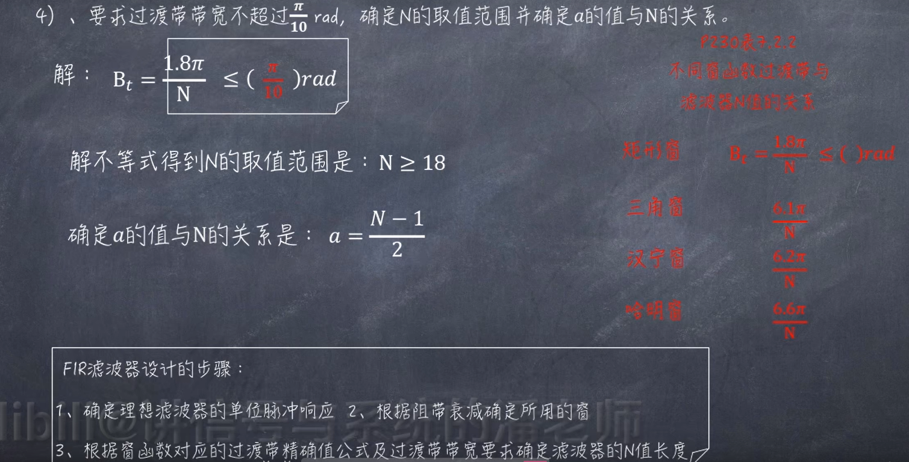
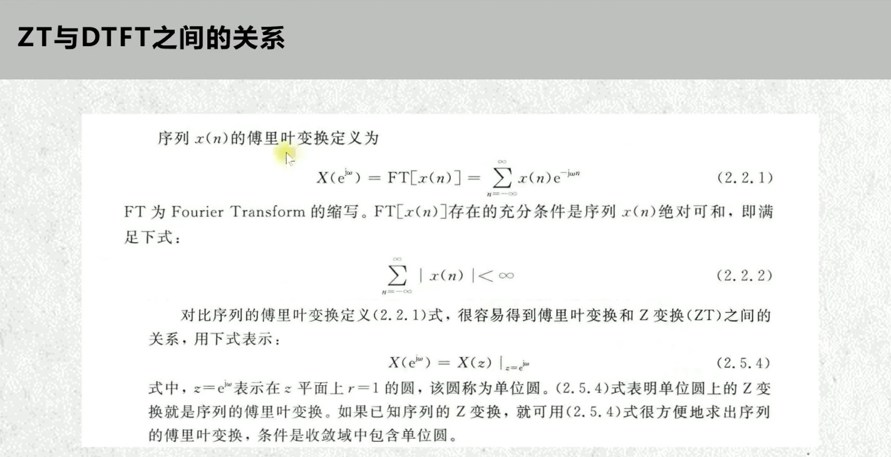

<hr>
tmux 分屏:

```ruby
1，输入命令tmux使用工具
2，上下分屏：ctrl + b 再按 "
3，左右分屏：ctrl + b 再按 %
4，切换屏幕：ctrl + b 再按o
5，关闭一个终端：ctrl + b 再按x
6，上下分屏与左右分屏切换： ctrl + b 再按空格键
```

<hr>

hysteria:

```
bash <(curl -fsSL https://git.io/hysteria.sh)
```
<hr>


  

  


  

共轭对称序列--实部是偶函数,虚部是奇函数

共轭反对称序列--实部是奇函数,虚部是偶函数

  

  

  

  

  


sin(ω) = (e^(jω) - e^(-jω)) / (2j)

cos(ω) = (e^(jω) + e^(-jω)) / 2

  

  

  

离散时间傅里叶变换(DTFT)性质
1. 周期性 时域-离散-非周期---频域-连续-周期 || 时域-连续-周期---频域-离散-非周期
2. 线性   
3. 时移与频移性质 设x(n)的DTFT为X(e^jω),则x(n-n0)的DTFT为X(e^jω)e^(-jωn0) || 设x(n)的DTFT为X(e^jω),则e^(jω0n)x(n)的DTFT为X(e^j(ω-ω0))
4. FT的对称性 实部对应的傅里叶变换具有共轭对称性,虚部对应的傅里叶变换具有共轭反对称性
5. 时域卷积和频域卷积定理 在时域卷积相当于在频域相乘,在频域卷积相当于在时域相乘
6. 帕斯维尔定理 时域能量等于频域能量--时域平方和等于频域在[-π,π]区间内的积分的2π分之一

  

  

  

  

常见z变换

  

z变换收敛域

  

  

  

  

  

  

IIR滤波器设计

  


  

  

  

  

  

  

即因果的收敛域包含了∞,稳定的收敛域包含了单位圆

  

W(N, nk) = e^(-j2πnk/N)

IIR

  

  

  

  

  

  

FIR线性相位结构

  

  

  

  

 
